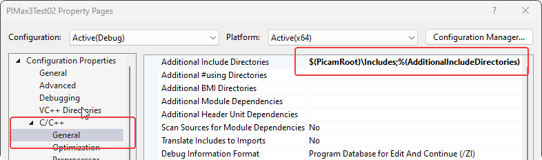
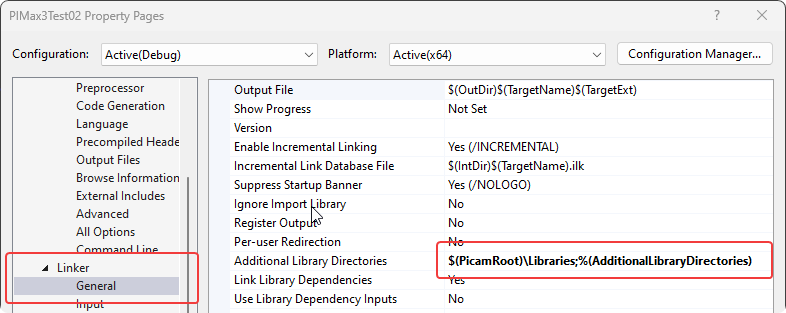
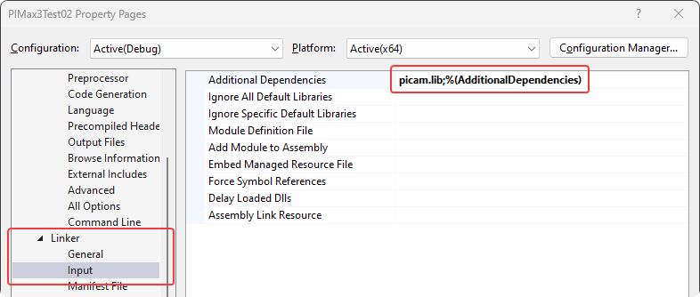
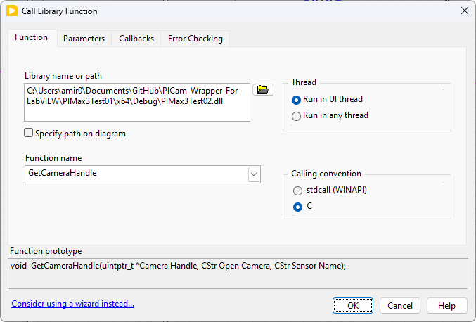
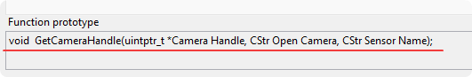
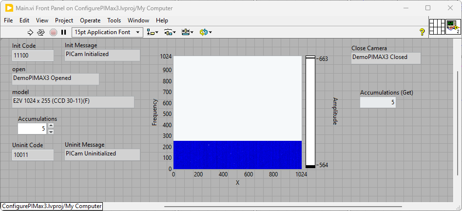

# PICam-Wrapper-For-LabVIEW

Simple C++ wrappers for PICam SDK to resolve necessary pointer, perform data conversions, and expose certain function to LabVIEW. I have tested this with PIMAX31024I and PIMAX31024x256 cameras.

## Introduction

This project is a simple C++ wrapper for the PICam SDK. The purpose of this wrapper is to resolve necessary pointers, perform data conversions, and expose certain functions to LabVIEW. The wrapper is designed to be used in LabVIEW as a DLL. The wrapper is not a complete wrapper for the PICam SDK, but it does provide a good starting point for developing a more complete wrapper.

PICam is a free SDK provided by Princeton Instruments for interfacing with their cameras. The SDK is written in C and is not directly compatible with LabVIEW. They offer a full solution with several
examples in many languages including LabVIEW but ... that solution
comes at a cost, and it is not very low.

## Getting Started

Here I include a simple example to compile a wrapper DLL and use it
in LabVIEW to set the number of on-chip accumulations and acquire 5 images.

- Download and install the PICam SDK from Princeton Instruments. You
need to fill their form online, and they will send you a link to download.
After the installation you will have a environment variable called PicamRoot.
You will use this variable to include the necessary headers and libraries.
- Setup C++ project in Visual Studio. I have included the solution in this
repository.

- Set up the project properties to include the necessary headers and libraries.



With this setup you should be able to compile the project and generate the DLL.
- In LabVIEW, whenever you drop a call library function node, browse
for the DLL you just created. Then, you can call the functions exposed.

Just make sure the function prototype at the bottom matches the
exposed function in the DLL.

```c
extern "C" __declspec(dllexport) void GetCameraHandle(PicamHandle &camera, char* openCameraMessage, char* sensorName);
```

The example VI is included in this repository, gets the handle to the first
camera, sets the number of on-chip accumulations to 5, and acquires 5 images.



This is just a prototype and I hope it will be helpful to get you started.
